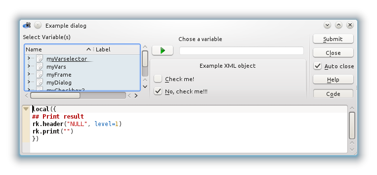
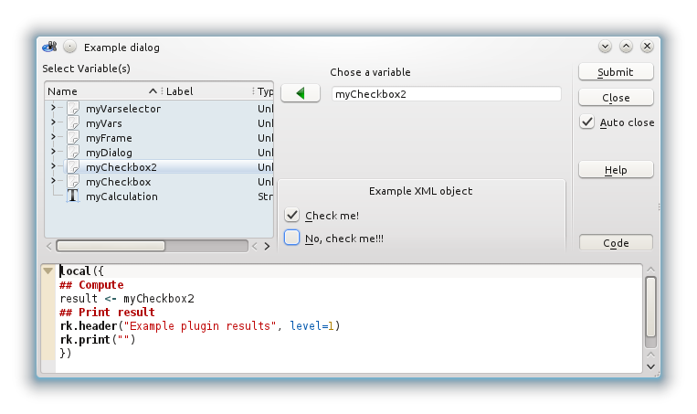
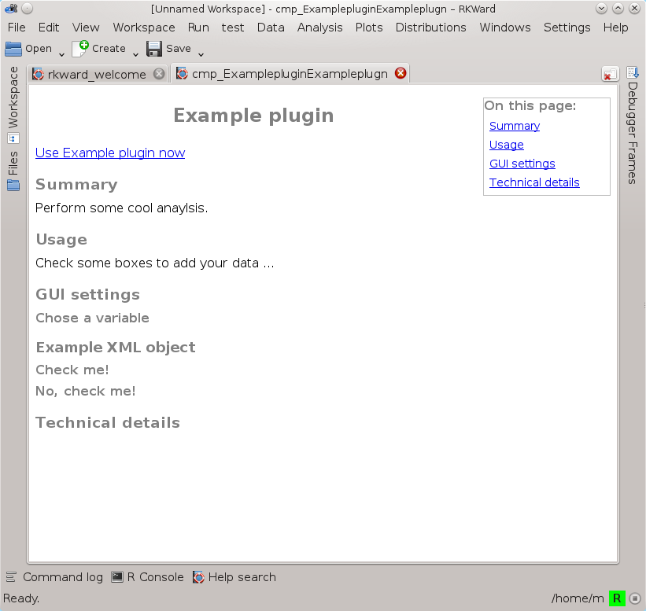

```{r, include=FALSE, cache=FALSE}
library(rkwarddev)
```

# About the package

You might ask why you should write R scripts to generate plugins, if you could just directly write the XML and JavaScript files. First of all, you don't have to use this package at all, it's totally fine to code your plugins how ever you like. The main reason why I wrote this package is that I like to really concentrate on what I'm doing, so this is my attempt to avoid the need to switch between several files in three different languages all the time. I wanted to be able to constantly »think in  `R`« while working on a plugin, and to oversee everything that matters in one script. As a side effect, a lot of useful automation was implemented, so using this package will definitely save you quite some amount of typing.


# Before we start

It is important to understand that while  `rkwarddev` can help you to make designing new plugins much easier, you still need to know how the generated XML and JavaScript files work and interact. That is, if you didn't yet read the [Introduction to Writing Plugins for RKWard](https://docs.kde.org/trunk5/en/rkward/rkwardplugins/index.html) please do so before you start working with this package. Once you're sure you understand how plugins in `RKWard` actually work, just come back here.


# Ingredients

If you look at the contents of the package, you might feel a little lost because of the number of functions. So let's first see that there's actually some order in the chaos.

Most functions start with the prefix  `rk.` to indicate that they somehow belong to `RKWard` (we'll get to the exceptions later). After that, many names have another abbreviation by which they can roughly be classified into their specific »area« of plugin development:

* `rk.XML.*()`: XML code for GUI description (and plugin maps)
* `rk.JS.*()`: JavaScript code
* `rk.rkh.*()`: XML code for help pages

In short, you should find a `rk.XML.*()` equivalent to every XML tag explained in the [Introduction to Writing Plugins for RKWard](https://docs.kde.org/trunk5/en/rkward/rkwardplugins/index.html) e.g. `rk.XML.dropdown()` to generate a `<dropdown>` menu node. There are a few functions for JavaScript generation which fall out of this scheme. That is because firstly they should be intuitively to use just like their JavaScript equivalent (like `echo()`), and secondly they are likely to be used very often in a script, so short names seemed to be a blessing here (like `id()` or `js()`).

Adding to that, there are some special functions, which will all be explained later, but here's the list, roughly ordered by the development stage they're used for:

* `rk.paste.JS()`: Paste JavaScript code from `rkwarddev` objects
* `rk.XML.plugin()`: Combine XML objects into one plugin GUI object
* `rk.JS.scan()`: Scan a GUI XML file (or  `rkwarddev` object) and generate JavaScript code (define all relevant variables)
* `rk.JS.saveobj()`: Scan a GUI XML file (or  `rkwarddev` object) and generate JavaScript code (save result objects)
* `rk.JS.doc()`: Combine JavaScript parts into one plugin JavaScript file object
* `rk.rkh.scan()`: Scan a GUI XML file (or  `rkwarddev` object) and generate a help page skeleton
* `rk.rkh.doc()`: Combine XML objects into one help page object
* `rk.plugin.component()`: Combine XML, JavaScript and help file objects into one plugin component object (i.e. one dialog, so *one* plugin can provide *several* dialogs in one package)
* `rk.testsuite.doc()`: Paste a testsuite skeleton
* `rk.XML.pluginmap()`: Combine XML objects into one plugin map object
* `rk.plugin.skeleton()`: Generate actual plugin files from the component, testsuite and plugin map objects (i.e., put all of the above together)
* `rk.build.plugin()`: Compress the generated files into an installable  `R` package for distribution


## Exceptions to the rule

As said before, there are some functions that fall out of the explained name scheme,i.e. they don't start with `rk.<XML|JS|rkh>.*()`. They are all relevant for the generation of JavaScript code, and this is just a short overview, how you use them will also be explained later on:

* `echo()`: Produces an equivalent of the JavaScript `echo()` function
* `id()`: Similar to paste, but replaces `rkwarddev` objects with their ID value
* `idq()`: Like `id`, but also quotes the ID value
* `js()`: Short for JavaScript, like `id()`, but will translate `if` control structures and some operands directly from R to JavaScript
* `qp()`: Short for »**q**uote \& **p**lus«, like `id()`, but with different replacement defaults
* `ite()`: Short for »**i**f, **t**hen, **e**lse«, a shortcut to generate JavaScript `if() \{\` else \{\}} conditions
* `tf()`: Short for »**t**rue/**f**alse«, a shortcut to `ite()` for XML checkbox objects
* `rk.comment()`: Creates a comment object to show up in the generated code -- works for both XML and JavaScript generation
* `i18n()`: Similar to `echo()`, used to mark strings as translatable


# Writing a plugin

The previously mentioned [Introduction to Writing Plugins for RKWard](https://docs.kde.org/trunk5/en/rkward/rkwardplugins/index.html) has a chapter on `rkwarddev` as well, which also includes a full example plugin already. This section will not so much repeat what you can learn there, but rather explain the basic steps to create a plugin »the `rkwarddev` way« in general. While doing that, we'll explore some of the alternative options you have when using different functions.

Some of them might not be so obvious at first, but I believe that once you know them, you'll learn to like them, too. The basic steps to write a plugin using this package can be summarized this way:

<ol>
  <li>Know how the `R` code works you want to generate with the plugin in the end</li>
  <li>Have an idea what the dialog should look like (e.g., a varselector left, a varslot and two checkboxes right, etc.)</li>
  <li>Use `rkwarddev` functions to</li>
  <ol style="list-style-type: lower-alpha;">
    <li>create XML objects for each of these dialog elements individually</li>
    <li>combine these individual objects to one dialog object</li>
    <li>create JavaScript objects (using the XML objects) responsible for the `R` code of the finished plugin</li>
    <li>create logic, wizard, ... objects the same way</li>
    <ol style="list-style-type: lower-roman;">
      <li>maybe also create help files objects</li>
      <li>combine all the dialog, logic, wizard, JavaScript ... objects into one plugin and have it written to disk (the plugin map will be generated almost by itself)</li>
    </ol>
  </ol>
</ol>

So you start with individual parts (the widget elements), combine them, combine what you combined, and so forth. 

To begin with some background info, this package makes use of another `R` package I wrote, called [XiMpLe](https://reaktanz.de/?c=hacking&amp;s=XiMpLe). It is a *very* simple XML parser/generator, hence its name. All `rkwarddev` functions dealing with XML utilize tools of this package, that is, the XML objects created are most likely of class `XiMpLe.node`, if not some other `XiMpLe` class.\footnote{The machanism for JavaScript is basically the same, but those classes and tools are all part of `rkwarddev` itself.}


## What you see is what you get, in the end

Both packages also come with `show` methods for their objects. This means that the object you create and how it looks when called in an R session are not the same: What you will see in your terminal is what the object *would* look like if you *pasted* it to a file, using the `paste` functions of the packages:

```{r, eval=TRUE}
rk.XML.frame(label="Example XML object")
```

If you examine the actual structure of the created object with `str()`, you can see the gory details:

```{r, eval=TRUE}
str(rk.XML.frame(label="Example XML object"))
```

Most of the time, you won't ever have to worry about that, since the objects will be handled by the package functions automatically. But it's important to understand that the results of these functions aren't simple character strings, allthough it might look like it at a first glance.


## Generating XML code

In the section before, we have already generated our first XML object: the `rkwarddev` function `rk.XML.frame()` produced a `<frame>` node. I guess this is pretty straight forward. Usually, a frame needs some content nodes to make sense, so we'll now create two simple checkbox\footnote{As an almost unique exception, the name of `rk.XML.cbox()` does not match the name of the generated XML node, »checkbox«. Don't worry about that.} objects, put them inside the frame and look at the result:

```{r, eval=TRUE}
myCheckbox <- rk.XML.cbox(label="Check me!")
myCheckbox2 <- rk.XML.cbox(label="No, check me!!!", chk=TRUE)
(myFrame <- rk.XML.frame(myCheckbox, myCheckbox2, label="Example XML object"))
```

What we can see here is that the generated code will automatically be indented, so the result will not only work, but still be human readable and look nice (and probably even better than what some might come up with otherwise...). We can also learn how nodes are made nested children of other nodes: All `rkwarddev` functions which can create parent to more than one node have the special »dots« parameter in their signature (`...`). That way you can give them arbitrary numbers of XML objects, and they just know what you want them to do with them.


### IDs

If you have a closer look you can also see one of the packages' automatic features: The node objects automatically received ID values, allthough we didn't specify any. By default, allmost all functions supporting IDs have `id.name="auto"` set, which as we've seen will not cause the ID to become `"auto"`, but a generated value. Usually an auto-ID is combined of the abbreviated node type and the abbreviated label given. So here, our `<frame>` node labelled »Example XML object« got the ID ``r XMLAttrs(myFrame)[["id"]]``. If we wanted a node to have some specific ID, we can use the `id.name` argument:

```{r, eval=TRUE}
rk.XML.cbox(label="Check me!", id.name="specificID")
```

Now, the fact that these nodes are actually objects of class `XiMpLe.node` gives us direct access to their attributes, including the ID:

```{r, eval=TRUE}
myCheckbox <- rk.XML.cbox(label="Check me!")
XMLAttrs(myCheckbox)[["id"]]
```

Again, mere mortals probably won't use this directly, but this makes it easy for functions read the IDs of XML nodes and use them. For example, if you wanted to define a varselector and a varslot, so the latter can take objects from the former, you need to give the varselector an ID and define that as the source in the varslot. If you wrote XML directly, you would give the `source` attribute the actual ID. With this package, you *can* do that too, but there is a much more elegant solution: Give the whole XML object and let the function extract the ID itself:

```{r, eval=TRUE}
(myVarselector <- rk.XML.varselector(id.name="my_vars"))
(myVars <- rk.XML.varslot(label="Chose a variable", source=myVarselector))
```

So basically you define an XML object and then re-use this single object throughout your plugin script, be it for actual XML generation or, as in this case, only for getting its ID. This means, in other words, you can tell the varslot »take variables from this object«, you don't have to worry about IDs *at all*. Just remember how you named an object and you can do all kinds of things with it.

This context dependent object handling will become even more useful when we get to the JavaScript part.


### From single elements to a dialog

Once you have an idea which elements you would like to see in your dialog, and have also created individual XML objects of them, you finally have to put them all together to form the full dialog XML. This is done by `rk.XML.dialog()`, in the same manner that `rk.XML.frame()` was used. To get the layout into the desired structure, use `rk.XML.row()` and `rk.XML.col()` to group elements into rows and columns, as nested as you see fit:

```{r, eval=TRUE}
(myDialog <- rk.XML.dialog(
    rk.XML.row(
        myVarselector,
        rk.XML.col(myVars, myFrame)
    ),
    label="Example dialog"
))
```

Now, wouldn't it be nice to see how that looks like in `RKWard`? Well, you can:

```{r, eval=FALSE}
rk.plugin.skeleton(
    about="Example plugin",
    xml=list(dialog=myDialog),
    load=TRUE,
    show=TRUE
)
```

    ## For file names ‘Example plugin’ was renamed to ‘Exampleplugin’.
    ## Created directory /tmp/RtmpeP21pI/Exampleplugin.
    ## Created directory /tmp/RtmpeP21pI/Exampleplugin/R.
    ## Created directory /tmp/RtmpeP21pI/Exampleplugin/inst/rkward/plugins.
    ## Created directory /tmp/RtmpeP21pI/Exampleplugin/inst/rkward/tests/Exampleplugin.
    ## For filenames ‘Example plugin’ was renamed to ‘Exampleplugin’.
    ## For filenames ‘Example plugin’ was renamed to ‘Exampleplugin’.
    ## For filenames ‘Example plugin’ was renamed to ‘Exampleplugin’.
    ## For filenames ‘Example plugin’ was renamed to ‘Exampleplugin’.
    ## [1] "/tmp/Rtmp9gdThb/Exampleplugin"

Allthough until now all we did was to outline the XML description of our plugin-to-become, `rkwarddev`
can already generate a full plugin. `load=TRUE` makes sure that `RKWard` recognizes the new plugin
immediately after it was created, and `show=TRUE` will even make it pop up, too:



Not so bad for less than 20 short lines of code. This makes dialog design both very efficient and flexible: Imagine you want to re-arrange the order of elements, or experiment with completely different tabbook layouts, all you need to do is to change the `rk.XML.dialog()` call and run `rk.plugin.skeleton()` again (with `overwrite=TRUE`). If you don't specify a directory explicitly, all will be written to a temporary directory. As seen in the example output, the return value of `rk.plugin.skeleton()` is allways the root directory of the created plugin.

Looking at the attribute `xml=list(dialog=myDialog)`, we can assume that

a. there's more than a `dialog` we can provide  
   *Further valid options are `wizard`, `logic` and `snippets`*
b. there's more to define than just the `xml` of a plugin  
   *Further arguments include `js`, `pluginmap`, `rkh` and `components`, among others*


Of course, this plugin doesn't really do anything useful. In fact, it doesn't matter how you treat the buttons and boxes, the R code below won't change a bit, because we didn't provide any JavaScript code to deal with those events.


## Generating JavaScript code

In contrast to what we've seen with the XML code, where objects are nested into others and the result is one big XML object, generated JavaScript code is always a plain character string in the end. This is because it doesn't make much sense to treat a programming language otherwise, if you don't want to lose its flexibility. But in between, existing objects will be re-used and new ones created as well. The best way to understand how `rkwarddev` handles the JavaScript part is to think of it as a specialized `paste()`. Its special feature is that it understands the objects we're dealing with, and depending on where they occur, knows what strings to make out of them.

Therefore, the most direct approach to get JavaScript into the plugin would to write it all by hand, paste it into a character object and give that to `rk.plugin.skeleton()`. But again, `rkwarddev` offers some helpful tools.


### Defining variables

We just created the XML dialog, which in turn of course includes all the elements (and their IDs) we need to care about. Or the other way round: For each element in the dialog it is pretty safe to assume that it should have *some* effect on the outcome. So for a start, `rkwarddev` can »scan« the dialog object^[In fact, `rk.JS.scan()` is not limited to R objects but can also read XML files.], collect all relevant IDs and define them as JavaScript variables automatically. Try this for a demonstration:

```{r, eval=TRUE}
cat(rk.JS.scan(myDialog))
```

Notice that only the varslot and both checkboxes show up -- `rk.JS.scan()` distinguishes between relevant and irrelevant IDs, e.g. a row or column is no GUI element of interest here. By the way, if you defined the frame as `checkable=TRUE`, its ID would be extracted as well.\footnote{There is also a related function called `rk.JS.saveobj()`, which scans for `<saveobject>` nodes and does not only define the neccessary variables, but also generates the full JavaScript code snippet for the `printout()` function, to effectively save result objects to workspace.}

You might also notice that the JavaScript variable names differ from the XML IDs. For once, that way they're harder to confuse with each other, and there's also some conventions which characters are allowed. But to cut things short, we don't have to worry about the variable names, just like we didn't have to care about the XML IDs before. We don't even have to call `rk.JS.scan()` ourselves, as `rk.plugin.skeleton()` will do so where appropriate, if the option `scan` includes `"var"`, which by default is the case.

This means, once more we can concentrate on what the plugin shall actually do, perhaps some calculation of a kind.


### Shortcut functions

The common task here is to check for certain dialog events (like unchecking the checkbox labelled »foo«), and then generate the according `R` code (like `foo=FALSE`). The question remains, if we don't know the actual variable names, how can we check for events of certain dialog elements in the JavaScript code? The answer to that is: We generate the code using `rkwarddev`'s special JavaScripting functions and paste it with `rk.paste.JS()`. That way, we can use the created XML objects once again, as reference to which element we actually mean.


#### echo()

The JavaScript equivalent to `paste()` is `echo()`, with a slightly different syntax: Concatenation is not done by commas, but by the plus sign, and the line must end with a semicolon. This is an example why it might be nice to not need to switch between languages back and forth any more. So `rkwarddev` has an `R` function called `echo()`, which translates `paste()`-like arguments into an equivalent JavaScript call:

```{r, eval=TRUE}
echo("# Value of the checkbox is: ", myCheckbox, "\n")
```

If this JavaScript code line was used, it would simply add a comment regarding the checkbox value to the `R` code, including a newline.


#### Control flow: ite() and js()

Now we know how to paste JavaScript code which echoes `R` code. What we definitely need at some point is `if` conditions. For that, `rkwarddev` offers to comfortable ways: Nesting actual `if` statements in `js()` calls, or using the `ite()` function. The latter is quite similar to the `R` function `ifelse()` and takes up to three arguments: One »if« condition, one »then« action, and optionally one »else« action. But actually, neither will the »if« condition be evaluated, nor will any of the actions be taken. The arguments just define what should be *pasted* at which part if the conditional statement:

```{r, eval=TRUE}
ite("foo", "bar", "baz")
```

However, in contrast to `echo()`, what `ite()` returns is not a character string, but similar to what we've seen with the XML functions a special JavaScript object. Amongst other things, this is useful to again generate readable code, e.g. nested conditions:

```{r, eval=TRUE}
ite(myCheckbox,
    ite(myVars,
        echo("result <- ", myVars, "\n"),
        echo("# huh?\n")
    ),
    ite(myCheckbox2,
        echo("## ouch!\n")
    )
)
```

Syntax-wise, `ite()` might look a bit weird. The good news is, that you can also use plain `if/else` statements if you put them inside a `js()` function call. That is, you write your control flow as if it was an `R` script, as `js()` will not evaluate the condition but translate it into JavaScript code:

```{r, eval=TRUE}
cat(js(
    if(myCheckbox){
        if(myVars){
            echo("result <- ", myVars, "\n")
        } else {
            echo("# huh?\n")
        }
    } else if(myCheckbox2){
        echo("## ouch!\n")
    }
))
```

As you can see, the resulting JavaScript code is very similar to the `R` code that created it, so using `js()` is probably preferable over `ite()`. Notice the `cat()` call here? In contrast to `ite()` the output of `js()` is already a character string.

But `js()` can do more: It also preserves some often used operators from evaluation, so for instance you can do comparisons in your `if` clause:

```{r, eval=TRUE}
mySpinbox <- rk.XML.spinbox(label="Set a value")
cat(js(
    if(myCheckbox == "true"){
        if(myVars){
            echo("result <- ", myVars, "\n")
        } else {
            echo("# huh?\n")
        }
    } else if(mySpinbox >= 0.3){
        echo("## a huge value!\n")
    }
))
```


#### rk.paste.JS()

To finally use this object in the plugin, it must be evaluated and transformed into a character string. This is where `rk.paste.JS()` comes into play:

```{r, eval=FALSE}
myCalculation <- rk.paste.JS(js(
    if(myCheckbox){
        if(myVars){
            echo("result <- ", myVars, "\n")
        } else {
            echo("# huh?\n")
        }
    } else if(myCheckbox2){
        echo("## ouch!\n")
    }
))
rk.plugin.skeleton(
    about="Example plugin",
    xml=list(dialog=myDialog),
    js=list(calculate=myCalculation),
    load=TRUE,
    show=TRUE,
    overwrite=TRUE
)
```

    ## For file names ‘Example plugin’ was renamed to ‘Exampleplugin’.
    ## For file names ‘Example plugin’ was renamed to ‘Exampleplugin’.
    ## For file names ‘Example plugin’ was renamed to ‘Exampleplugin’.
    ## For file names ‘Example plugin’ was renamed to ‘Exampleplugin’.
    ## For file names ‘Example plugin’ was renamed to ‘Exampleplugin’.
    ## [1] "/tmp/Rtmpk8Onz5/Exampleplugin"
    ## Warnmeldung:
    ## tests: Skipping existing file /tmp/Rtmpk8Onz5/Exampleplugin/inst/rkward/tests/testsuite.R. 

Now the plugin actually changes the generated code if you select an object from the workspace and toggle the checkboxes:



 
## Adding help pages

To help users understanding your plugin, it is a good practice to add a help page to it, allthough it is optional, technically. A help starts with a summary and global usage information, and then usually has detailed information on each GUI element of the plugin dialog. It is very easy to add a help page with `rkwarddev`, so there is literally no excuse.


### Summary and usage sections

For those global sections (as well as for links, technical information etc.), the package has designated functions:

```{r, eval=TRUE}
(mySummary <- rk.rkh.summary("Perform some cool anaylsis."))
(myUsage <- rk.rkh.usage("Check some boxes to add your data ..."))
```


### Help on GUI elements

Helpful information on individual GUI elements are added directly to the element definition. Think of it as some kind of *literate programming*, since the documentation becomes part of the code, so hopefully you don't forget to change it if you change your code:

```{r, eval=TRUE}
mySpinbox <- rk.XML.spinbox(
    label="Set a value",
    help="If you spin this, the result will change.",
    component="Value setters"
)
```

The `help` argument must be used in combination with the `component` of your plugin where this element belongs to. Both is not being added to the XML code or even the resulting object, but to an internal environment of the running `R` session, where `rkwarddev` will look for it when help pages are being build. In case you need to check its value, you might use the appropriate getter function:

```{r, eval=TRUE}
rk.get.rkh.prompter(component="Value setters", id=mySpinbox)
```

In the end, you can add all of the help stuff to your plugin. The information you added to the XML objects is automatically detected and fetched if you keep `"rkh"` in the `scan` option of `rk.plugin.skeleton()`, which by default is the case. Global help objects must be given as a named list to its `rkh` option:

```{r, eval=FALSE}
rk.plugin.skeleton(
    about="Example plugin",
    xml=list(
        dialog=myDialog
    ),
    js=list(
        calculate=myCalculation
    ),
    rkh=list(
        summary=mySummary,
        usage=myUsage
    ),
    load=TRUE,
    show=TRUE,
    overwrite=TRUE
)
```

Now the plugin has a working *Help* button which opens a page in the help browser:




# Turning existing plugins into `rkwarddev` scripts

Imagine you already have your (manually written) `RKWard` plugin, and now would like to continue its development using an `rkwarddev` script. Do you have to rewrite everything from scratch? Fortunately, you don't. And even if you don't want to use `rkwarddev` for further development, the following might still be helpful for you, as it can be used to check your plugin code for undetected errors.

The function `plugin2script()` can be used to go the other way around and generate `rkwarddev` script code from plugin XML code. It is capable of parsing *.xml files or `XiMpLe` objects. If the parsed code contains invalid syntax, you should get a warning, otherwise it returns a character string that can be used in a script to generate the equivalent XML code:

```{r, eval=TRUE}
cat(plugin2script(myDialog))
```

This can be optimized, e.g., by re-ordering the object defintions without all the nesting, replacing the character string `source="my_vars"` in `rk.XML.varslot()` with the varselector object etc. But it sure is a good start and saves a lot of typing. Most importantly, the generated XML object of this script code is identical to the analyzed object:

```{r, eval=TRUE}
identical(eval(parse(text=plugin2script(myDialog))), myDialog)
```
